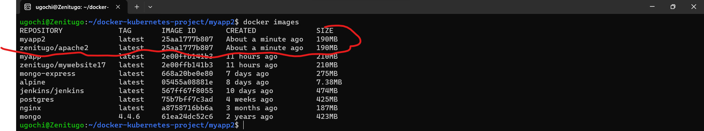
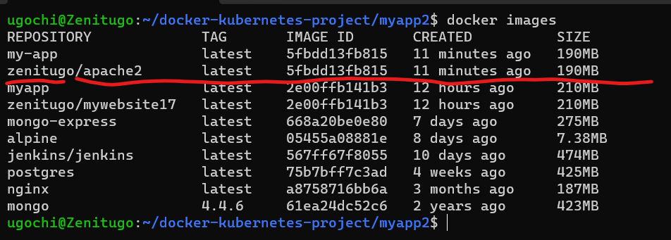

# TASK

**Deploying a static website and packaging in a container image based off on apache2**

The Dockerfile  provided is for packaging a website in a container image, push it to docker hub and creating a container from the image in docker hub.

Dockerfile is also another way of automating a process. The commands in the docker file are the commands you run on the terminal if you wanted to manually deploy the website.

The base image is apache2 which simply means we have started the webserver and there is no need to include the `systemctl start httpd` and `systemctl enable httpd`

The default website to host apache2 website is `var/www/html` but in the docker documentation of httpd:2.4, the static site should be hosted on `/usr/local/apache2/htdocs/`

To build the image use command `docker build -t <name of image>`
You can give it any name you like.

The command `docker images` outputs the docker images created.

To push it to docker hub
- go to your docker hub account
- create a repository
- give your docker image your repository name using command `docker tag <name of image> <repository name>`
- run command `docker push <repository name>`

**list of docker images created**

**image of docker image push to repo in docker hub**

**image of website deployed in container**

